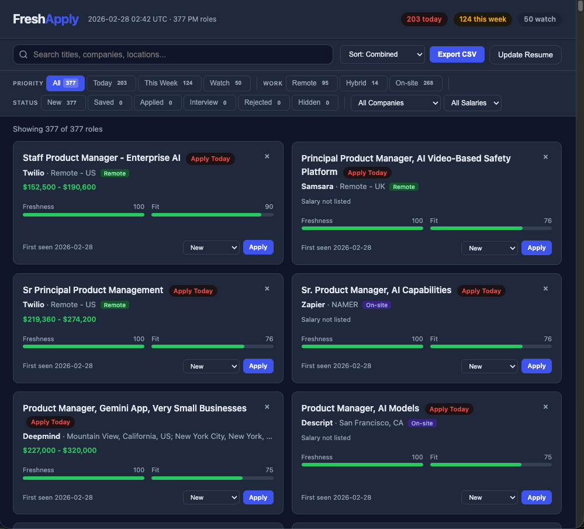
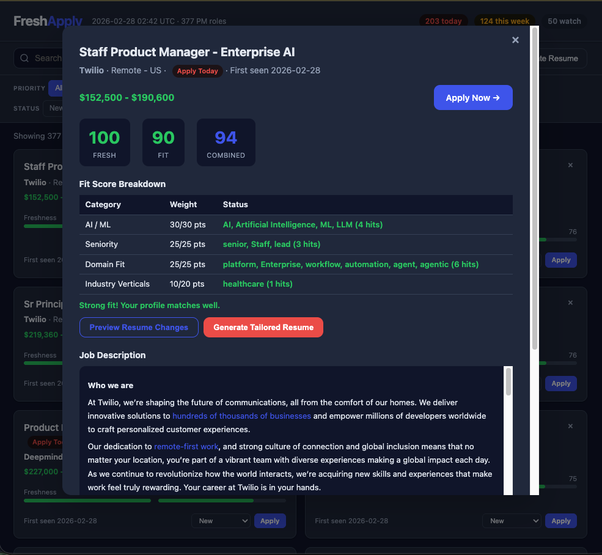

# FreshApply

A zero-dependency Python tool that scrapes PM and AI PM job postings from 65+ tech companies, scores them on freshness and fit, and generates an interactive HTML dashboard you can open in any browser.





## Quick Start

```bash
cp resume.example.json resume.json   # Edit with your info
python3 freshapply.py
```

That's it. No `pip install`, no API keys, no config files. Just Python 3.10+ standard library.

### Setup your resume

Copy the example and fill in your details:

```bash
cp resume.example.json resume.json
```

Edit `resume.json` with your name, location, experience, and skills. The fields that matter most:

| Field | What it does |
|-------|-------------|
| `country` / `city` | Flags jobs as Local, Relocation, or International |
| `headline` / `tagline` | Used in tailored resume downloads |
| `experience` | Bullets are reordered per job based on keyword relevance |
| `competencies` | Ranked and reordered in tailored resumes |

`resume.json` is gitignored — your personal data stays local.

## What It Does

1. **Scrapes** public ATS JSON APIs across 4 platforms (Greenhouse, Lever, Ashby, Workable)
2. **Filters** for Product Manager / AI PM roles using keyword matching
3. **Stores** every job in a local SQLite database, tracking when each role was first and last seen
4. **Detects reposts** by hashing job descriptions and comparing against historical data
5. **Scores** each role on two axes:
   - **Freshness (0-100)** — how recently the role appeared, with a penalty for reposts
   - **Fit (0-100)** — weighted keyword matching for AI/ML, seniority, platform/infrastructure, and industry verticals
6. **Prioritizes** into three tiers: Apply Today, Apply This Week, Watch List
7. **Generates** a Markdown digest and an interactive HTML dashboard

## Companies Tracked (65+)

| ATS | Companies |
|---|---|
| **Greenhouse** | Airbnb, Airtable, Amplitude, Anthropic, Applied Intuition, Arize AI, AssemblyAI, Brex, Coinbase, Compass, Cresta, Databricks, Datadog, DeepMind, Descript, Figma, Fireworks AI, GitLab, Glean, Gong, Grammarly, Hebbia, Inflection AI, Nuro, OneTrust, Runway, SambaNova Systems, Samsara, Scale AI, Snorkel AI, Stability AI, Stripe, Together AI, Twilio, Vercel, Verkada |
| **Ashby** | Anyscale, Baseten, Character.AI, Cohere, Cursor, Decagon, Deepgram, ElevenLabs, Harvey, LangChain, Linear, Modal, Notion, OpenAI, Perplexity, Pinecone, Ramp, Replit, Rula, Sierra, Twelve Labs, Writer, Zapier |
| **Lever** | Mistral, Plaid, Zoox |
| **Workable** | Hugging Face, Kody, Leadtech, Smeetz |

## Dashboard Features

The HTML dashboard is a single self-contained file — no server needed.

- **Search** across titles, companies, and locations
- **Filter** by company, tier, or application status
- **Sort** by combined score, freshness, fit, company, or date
- **Track applications** — mark jobs as Saved, Applied, Interviewing, or Rejected (persists in localStorage)
- **Score breakdown** — click any card to see exactly which keywords matched and how the fit score was calculated
- **Notes** — add personal notes to any job (persists in localStorage)
- **Hide** irrelevant roles without deleting them
- **Export CSV** of the current filtered view
- **Dark mode** — follows your system preference

## Usage

```bash
# Full run: scrape all boards, score, generate digest + dashboard
python3 freshapply.py

# Regenerate outputs from existing database (no network requests)
python3 freshapply.py --digest
```

Output files are written to `digests/`:
- `digest-YYYY-MM-DD.md` — Markdown summary
- `dashboard-YYYY-MM-DD.html` — interactive HTML dashboard (open in browser)

## Scoring

### Freshness (0-100)

| Age | Score |
|---|---|
| < 6 hours | 100 |
| < 24 hours | 90 |
| < 48 hours | 80 |
| < 72 hours | 70 |
| < 1 week | 55 |
| < 2 weeks | 35 |
| < 30 days | 15 |
| 30+ days | 5 |

Reposts receive a -15 penalty.

### Fit (0-100)

| Category | Weight | Keywords |
|---|---|---|
| AI / ML | 15 | ai, ml, llm, machine learning, generative, deep learning, nlp, gpt, transformer |
| Seniority | 10 | senior, staff, principal, director, lead, head of, vp |
| Domain Fit | 8 | platform, enterprise, infrastructure, workflow, automation, agent, agentic |
| Industry Verticals | 6 | real estate, proptech, healthcare, health tech, clinical |

### Tier Assignment

- **Today** — freshness >= 80 (posted within 48 hours), fit >= 40, and AI keywords present
- **This Week** — freshness >= 55 (posted within 7 days), fit >= 25
- **1 Week+** — everything else

## Customization

Edit the constants at the top of `freshapply.py` to:

- **Add companies** — append board slugs to `GREENHOUSE_COMPANIES`, `LEVER_COMPANIES`, `ASHBY_COMPANIES`, or `WORKABLE_COMPANIES`
- **Change title filters** — modify `PM_TITLE_PATTERNS` to match different roles (e.g., add `r"software\s+engineer"`)
- **Adjust fit keywords** — edit `FIT_KEYWORDS` to change scoring weights or add new keyword buckets
- **Tune tier thresholds** — modify the `tier()` function

## License

[MIT](LICENSE)
